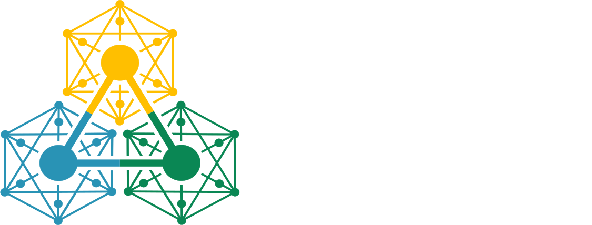

<p align="center">
  <picture>
    <source media="(prefers-color-scheme: dark)" srcset="docs/assets/NPAP-Banner-light.svg">
    <source media="(prefers-color-scheme: light)" srcset="docs/assets/NPAP-Banner-dark.svg">
    
  </picture>
</p>

<!-- Badges -->
[](https://pypi.org/project/npap/)
[](https://pypi.org/project/npap/)
[](LICENSE)
[](https://npap.readthedocs.io)
[](https://codecov.io/gh/IEE-TUGraz/npap)
[](https://results.pre-commit.ci/latest/github/IEE-TUGraz/npap/main)
[](https://github.com/astral-sh/ruff)

---

**NPAP** is an open-source Python library for **partitioning and aggregating network graphs**, with a special focus on electrical power systems. Built
on top of [NetworkX](https://networkx.org/), it provides a clean strategy-based architecture that makes it easy to cluster networks and reduce their
complexity while preserving essential properties.

Whether you're working with power grids, transportation networks, or any graph-based spatial data, NPAP helps you simplify complex networks into
manageable pieces.

## Features

- **Multiple Partitioning Algorithms** - K-means, K-medoids, DBSCAN, HDBSCAN, and hierarchical clustering
- **Distance Metrics** - Euclidean for local coordinates, Haversine for geographic data
- **Electrical Distance** - Partition based on PTDF-derived electrical proximity
- **Voltage-Aware Clustering** - Respects voltage levels and transformer boundaries
- **Flexible Aggregation** - Sum, average, or custom strategies for node/edge properties
- **Extensible Design** - Easy to add your own partitioning or aggregation strategies

## Installation

```bash
pip install npap
```

## Quick Start

```python
from npap import PartitionAggregatorManager, AggregationProfile, AggregationMode

# 1. Initialize the manager
manager = PartitionAggregatorManager()

# 2. Load data (voltage-aware loader for power systems)
manager.load_data(
    strategy='va_loader',
    node_file="buses.csv",
    line_file="lines.csv",
    transformer_file="transformers.csv",
    link_file="links.csv"
)

# 3. Aggregate parallel edges (optional)
manager.aggregate_parallel_edges(
    edge_properties={"x": "equivalent_reactance", "type": "first"},
    default_strategy="average"
)

# 4. Partition the network
manager.partition(strategy="electrical_kmedoids", n_clusters=50)

# 5. Visualize the partitioned network
manager.plot_network(style='clustered', title='Partitioned Network')

# 6. Aggregate with a custom profile
profile = AggregationProfile(
    mode=AggregationMode.GEOGRAPHICAL,
    topology_strategy="simple",
    node_properties={"lat": "average", "lon": "average", "voltage": "average"},
    edge_properties={"p_max": "sum", "x": "equivalent_reactance"},
    default_node_strategy="average",
    default_edge_strategy="average"
)
aggregated_network = manager.aggregate(profile=profile)

# 7. Visualize the reduced network
manager.plot_network(style='simple', title='Aggregated Network')
```

## Contributing

We warmly welcome contributions from everyone! Whether it's fixing a typo, improving documentation, reporting bugs, or implementing new features —
every contribution matters.

Please read our [Contributing Guide](CONTRIBUTING.md) to get started. Don't hesitate to open an issue if you have questions or ideas!

## Acknowledgements

Funded by the European Union (ERC, NetZero-Opt, 101116212). Views and opinions expressed are however those of the author(s) only and do not
necessarily reflect those of the European Union or the European Research Council. Neither the European Union nor the granting authority can be held
responsible for them.

## License

NPAP is released under the [MIT License](LICENSE).

---

<p align="center">
  <i>Built with care for the open-source community 🫰</i>
</p>
